# 📊 Customer Churn Analysis – Case Study 

## 📝 Project Overview  
Customer churn is one of the most critical challenges for subscription-based businesses. It represents the percentage of customers who stop using a service over a given period. Understanding churn patterns helps businesses reduce customer loss and improve retention strategies.  

This project is a **case study on customer churn analysis** for a fictitious telecom company **Databell**.  
The dataset contains customer demographics, subscription details, and service usage information.  

The analysis and dashboard were built using **Power BI**.  

---

## ❓ Problem Statement  
Databell has been experiencing **high customer churn**, leading to revenue loss and reduced market share.  
The company wants to:  
- Identify the **key drivers of customer churn**.  
- Understand **which customer groups are more likely to churn**.  
- Provide **actionable solutions** to reduce churn and improve customer satisfaction.  

---

## 📂 Steps Involved  

1. **Data Collection**  
   - Dataset from fictitious company **Databell**.  
   - Included customer demographics, contract type, billing info, service usage, and churn status.  

2. **Data Cleaning & Preprocessing**  
   - Removed missing/invalid entries.  
   - Verified categorical fields (contract type, international plan, etc.).  
   - Checked churn distribution across various attributes.  

3. **Exploratory Data Analysis (EDA)**  
   Conducted in **Power BI** using:  
   - Churn rate calculations.  
   - Customer demographics breakdown (age, gender, location).  
   - Service usage comparison (International Plan, Unlimited Data Plan).  
   - Contract type and payment method analysis.  

4. **Dashboard & Report Creation**  
   - Created an interactive **Power BI dashboard** with visuals for churn distribution, contract types, churn reasons, and state-level churn.  

---
## 📸 Dashboard Screenshots  

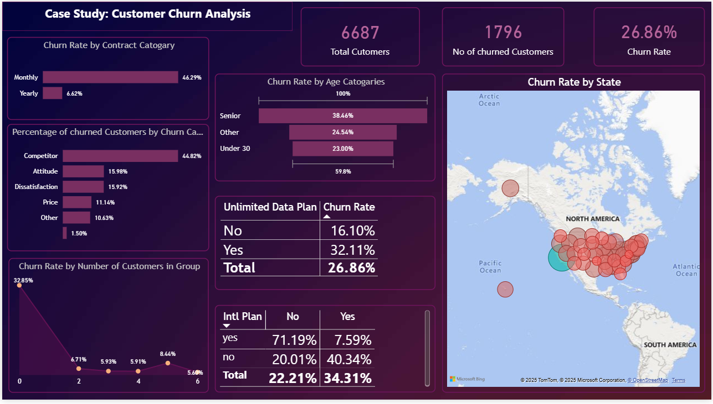  

## 📸 Report Screenshots 

### 1. Churn Rate 
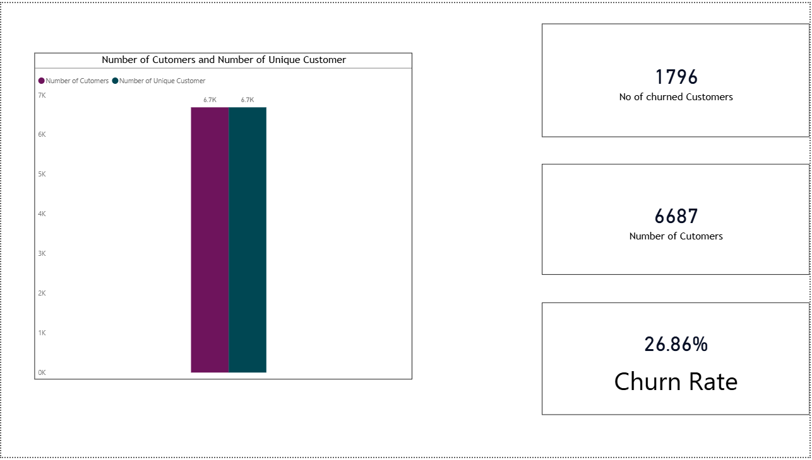  

### 2. Main Reason For Churn 
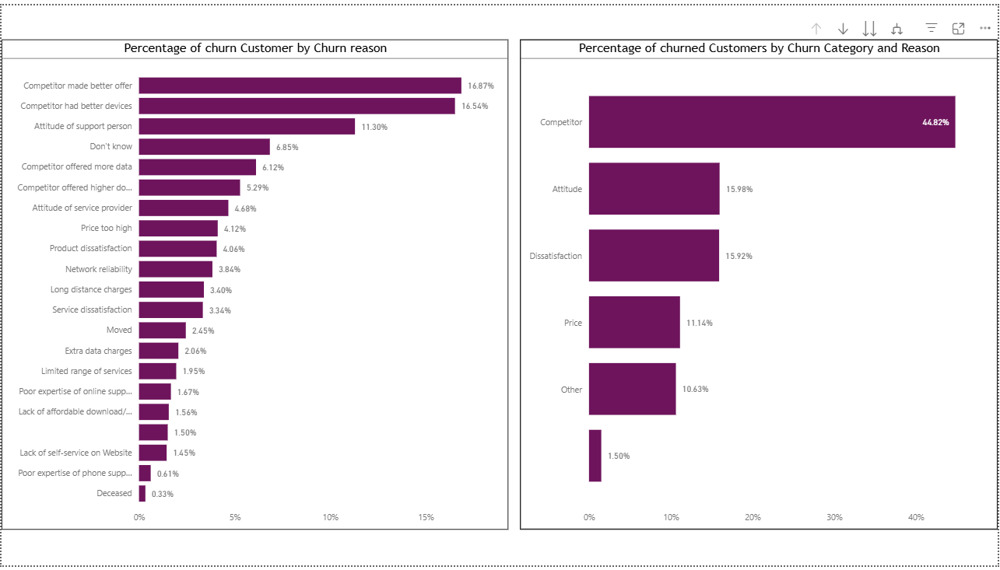  
### 3. Churn Rate by State 
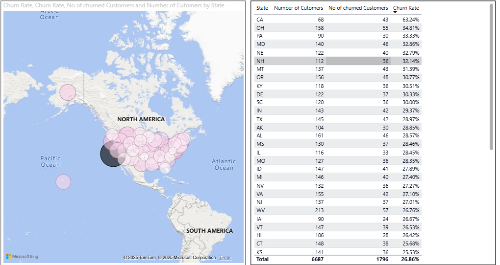  
### 4.  Churn Rate By 3 Age Categories
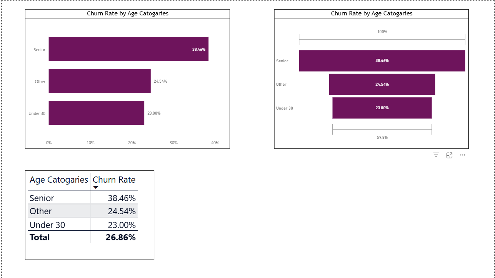  
### 5. Churn Rate By Age Bins
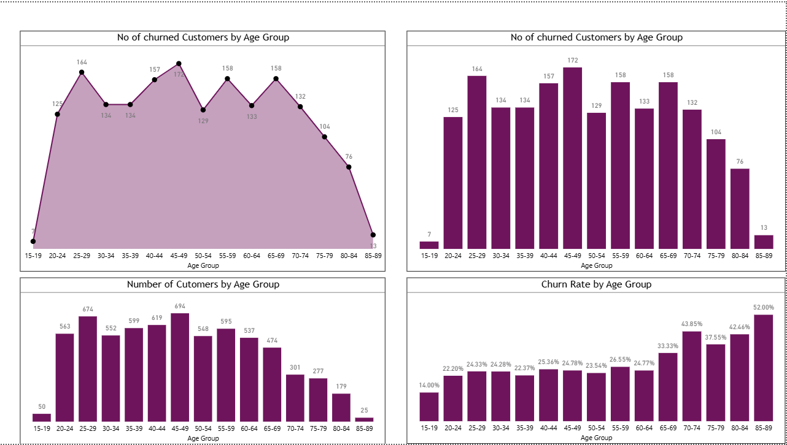  
### 6. Inspecting Groups
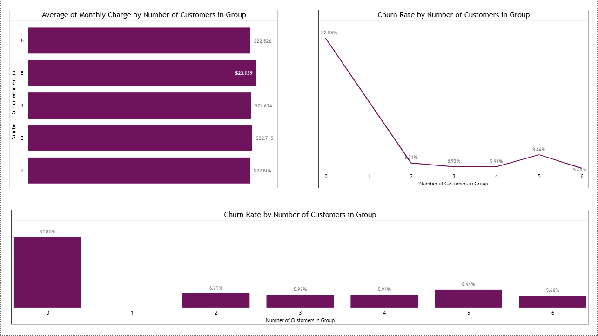  
### 7. Multiple Feild
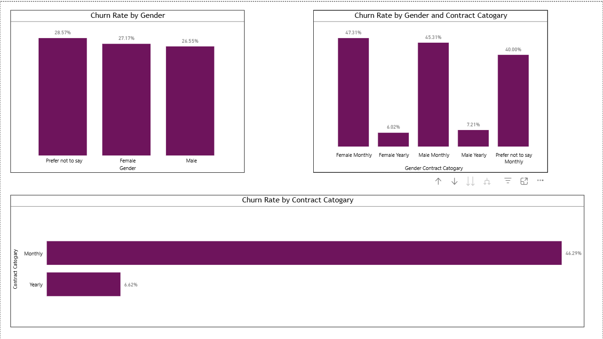 
### 8. Unlimited Plan 
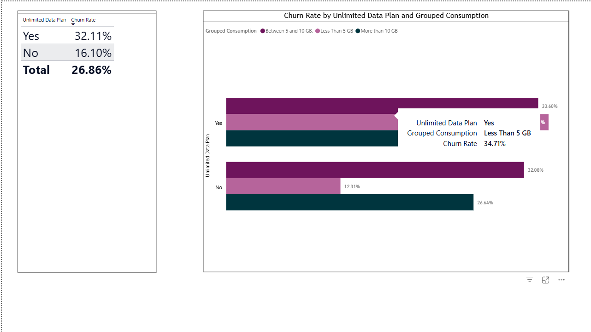  
### 9. Internation Plan 
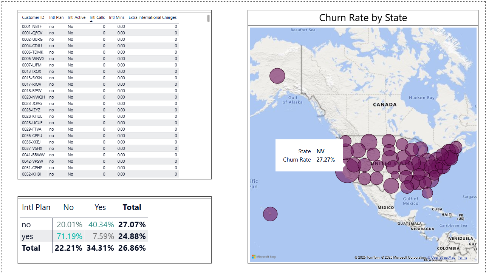  
### 10. Contract Type
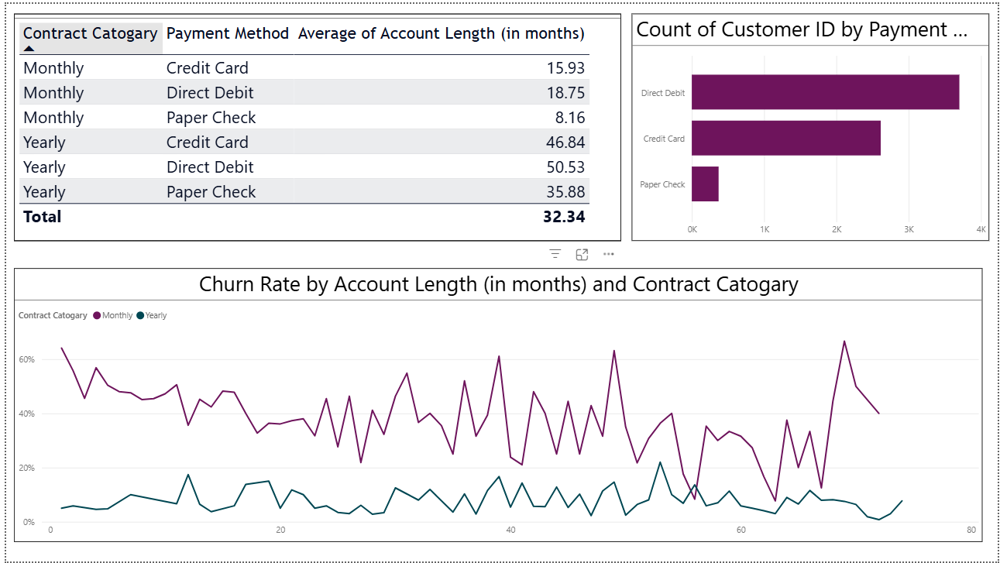  

---

## 🔑 Key Findings  

- **Overall Churn Rate**:  
  - Out of **6,687 customers**, **1,796 churned** → **26.86% churn rate**.  

- **Churn by Geography**:  
  - **California (CA)** had the **highest churn rate (63.24%)**.  

- **Churn by Contract Type**:  
  - **Monthly contracts**: 46.29% churn.  
  - **Yearly contracts**: only 6.62% churn.  

- **Churn by International Plan**:  
  - Customers **with international plans but not activating them** → **71.19% churn rate**.  
  - Indicates lack of awareness about **extra charges**.  

- **Churn by Age**:  
  - **Senior customers (60+)** had the highest churn rate (**38.46%**).  

- **Churn Reasons**:  
  - Competitor offers → **44.82%**.  
  - Service dissatisfaction & price issues followed closely.  

---

## 💡 Proposed Solutions  

1. **Customer Awareness Campaign**  
   - Educate customers about **extra charges** for international plans.  
   - Send **alerts/reminders** for unused activated plans.  

2. **Targeted Retention Strategy**  
   - Offer **discounts/bundles** for international plan users.  
   - Promote **yearly contracts** with attractive discounts.  

3. **Improve Service Quality**  
   - Enhance **customer service training**.  
   - Monitor **competitor pricing** to stay competitive.  

4. **State-Specific Retention**  
   - Investigate reasons behind **California’s high churn**.  
   - Launch **loyalty programs** in high-churn regions.  

---

## 📌 Conclusion  
This case study shows that churn at **Databell** is influenced by:  
- Unused international plans with extra charges.  
- Competitor offers.  
- Monthly contracts.  
- Certain geographic locations (especially California).  

👉 By implementing **awareness campaigns, retention offers, and service improvements**, Databell can reduce churn and increase customer satisfaction.  

---

## ⚙️ Tools Used  
- **Power BI Desktop** → Dashboard & Visualization  
- **Excel / CSV Dataset** → Data handling  

---

 

